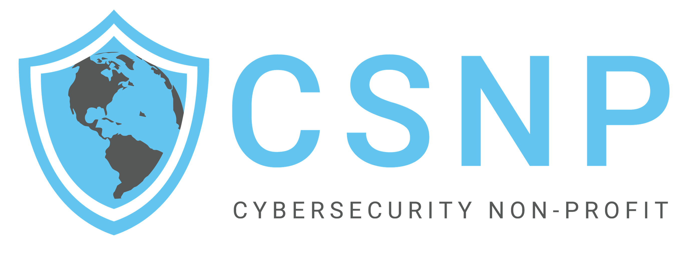

# Trello Card Creator Script



Effortlessly create Trello cards from a Word document.

---

## Overview

The **Trello Card Creator Script** allows you to batch-create multiple Trello cards directly from a Microsoft Word document (`.docx`). If you manage tasks or projects in Word and want to transfer them to Trello, this script automates the process, saving you time and effort.

*Pro Tip:* If your Word document needs to follow a specific format, consider using a Generative AI like ChatGPT or Claude AI to help reformat your text according to the script's requirements.

---

## Quick Start Guide

### Requirements

Before you begin, make sure you have the following:

- **Python 3.8 or higher**
- **A Trello Account**
- **Trello API Key and Token**

### Step 1: Install Python

#### For Windows Users

1. **Download Python**:
   - Go to [python.org](https://www.python.org/downloads/windows/).
   - Click **"Download Python 3.x.x"**.

2. **Run the Installer**:
   - Open the downloaded installer.
   - **Check** the box labeled **"Add Python 3.x to PATH"**.
   - Click **"Install Now"**.

#### For Mac Users

1. **Download Python**:
   - Visit [python.org](https://www.python.org/downloads/mac-osx/).
   - Click **"Download Python 3.x.x"**.

2. **Install Python**:
   - Open the downloaded file.
   - Follow the prompts to complete the installation.

---

### Step 2: Download the Trello Card Creator Script

1. **Get the Script**:
   - Download it from the [GitHub Repository](https://github.com/csnp/create_trello_cards).
   - Click the green **"Code"** button, then select **"Download ZIP"**.

2. **Extract Files**:
   - After downloading the ZIP file, right-click on it and select **"Extract All..."** (Windows) or double-click it (Mac) to unzip the folder.

---

### Step 3: Install Dependencies

1. **Open Command Prompt or Terminal**:

   - **Windows**: Press `Win + R`, type `cmd`, and press **Enter**.
   - **Mac**: Open **Terminal** from `Applications > Utilities`.

2. **Navigate to the Script Directory**:

   Replace `path/to/your/script` with the actual path where you extracted the script.

   ```bash
   cd path/to/your/script


3. **Install Dependencies:**:

    ```bash
    pip install -r requirements.txt

4. **Obtain Trello API Key and Token:**:

    Follow the instructions in the Getting Trello API Credentials guide.

5. **Run the Script:**:

    1. Execute the Script:

    ```bash
    python trello_card_creator.py

    2. Follow On-Screen Prompts:

    - Enter API Credentials when prompted.
    - Provide Trello Board URL.
    - Select your docx or Create a sample Word Document.

6. **Format Your Word Document:**:

    Refer to the Word Document Format guide to properly format your .docx file.

7. **Run the Script Again (if needed):**:
    If you updated your Word document, rerun the script to create the cards on Trello.

## Detailed Documentation

For exhaustive instructions and troubleshooting, please refer to the MkDocs Documentation.
