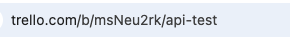

# Usage Guide

Learn how to run the script and create Trello cards from your Word document.

---

## Step 1: Run the Script

*In your terminal (or command prompt), navigate to the folder where the script is located, and run:*

`python trello_card_creator.py`

---

## Step 2: Follow On-Screen Prompts

1. **Enter API Credentials**:

   - **API Key**: Paste when prompted.
   - **API Token**: Paste when prompted.

2. **Provide Trello Board URL**:

   - Copy the URL from your Trello board and paste it when prompted.

   

3. **Select or Create a Word Document**:

   - **Option A**: If you have a Word document ready, type `y` when asked.
     - A file dialog will open. Navigate to and select your `.docx` file.
   - **Option B**: Type `n` to generate a sample template.
     - The script will create a `sample_template.docx` file in the script directory.
     - Open this file, fill in your card details, and save it.

---

## Step 3: Format Your Word Document

- Refer to the [Word Document Format](word_document_format.md) guide to properly format your `.docx` file.

---

## Step 4: Run the Script Again (if needed)

- If you updated your Word document, rerun the script:

  `python trello_card_creator.py`
