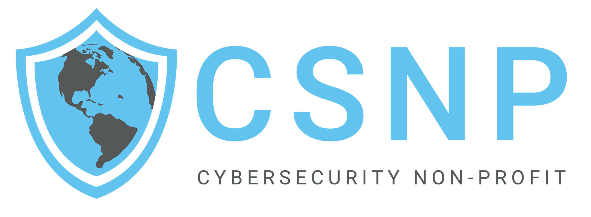

# Trello Card Creator Script

Create Trello cards easily from a Word document.

---

## Overview

Welcome to the **Trello Card Creator Script**! This tool allows you to create multiple Trello cards at once by reading the details from a Microsoft Word document (`.docx` file). It's perfect for users who prefer organizing their tasks or ideas in a Word document and want to transfer them to Trello without manually creating each card.

---

## Features

- **Batch Card Creation**: Create multiple Trello cards from a single Word document.
- **Customizable Cards**: Include titles, descriptions, labels, due dates, members, checklists, attachments, and cover images.
- **User-Friendly**: No programming knowledge required.
- **Secure**: Your Trello credentials are stored securely on your computer.

[Get Started](installation.md)
